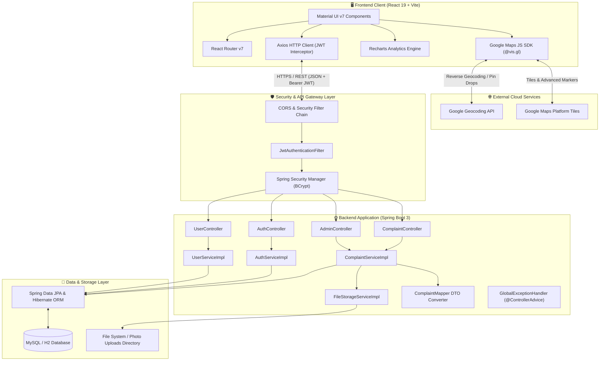
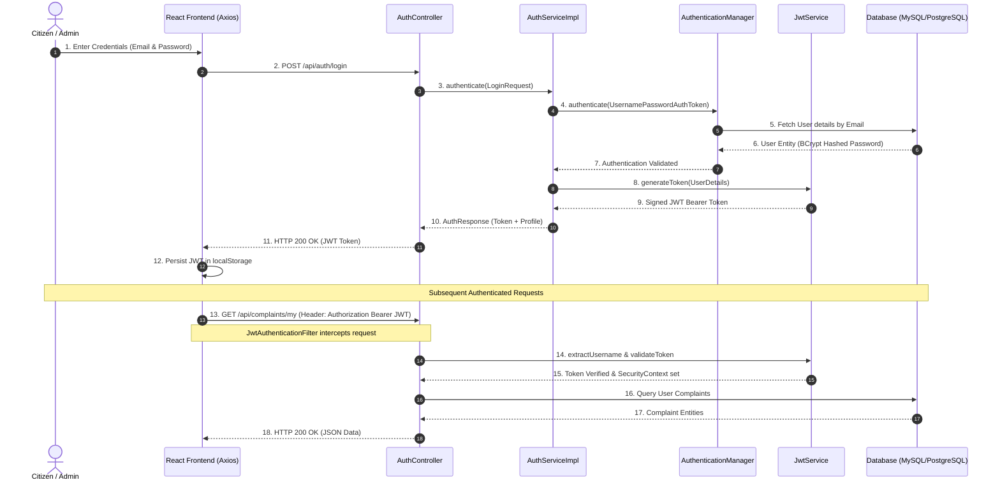
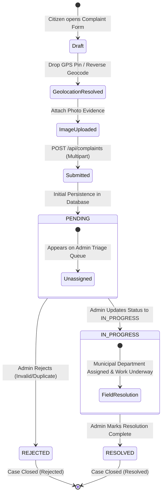
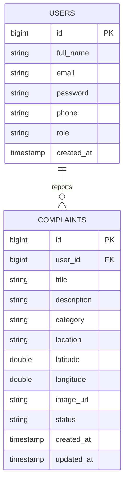
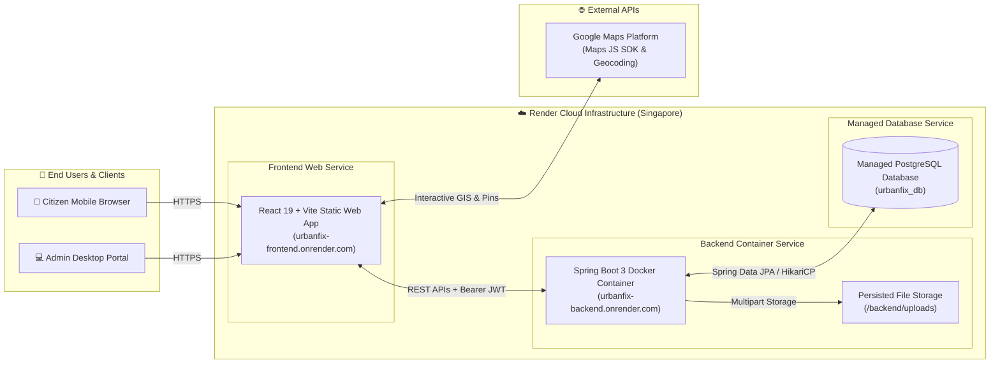

# 🏙️ UrbanFix - Civic Issue Reporting & Management Platform

UrbanFix is a production-grade full-stack civic engagement platform that enables citizens to report public infrastructure issues with GPS coordinates, descriptions, and photo evidence.

The platform features a **React 19 + Material UI** frontend and a **Spring Boot 3 + MySQL/PostgreSQL** backend for complaint triage, status tracking, and telemetry analytics.

---

## ✨ Features Implemented

### 🛡️ Authentication & Security
- **JWT Authentication**: Stateless authentication with JWT storage in `localStorage` and `Bearer` token authorization headers.
- **Spring Security Integration**: BCrypt password hashing, custom `UserDetailsService`, stateless session policies, and `JwtAuthenticationFilter`.
- **Role-Based Access Control**: Strict segregation between `CITIZEN` (`USER`) and `ADMIN` roles for dashboard access and complaint management.
- **Centralized Session Cleanup**: Auto-logout interceptor handling 401 Unauthorized responses.

### 📋 Complaint & Report Module
- **Civic Issue Reporting**: Submit complaints with title, category, description, landmark address, GPS coordinates, and photo evidence.
- **Interactive Google Maps GIS**: Drag and drop pins on live Google Maps (`@vis.gl/react-google-maps`) with automatic reverse-geocoding into street addresses and browser GPS positioning.
- **Multi-Marker Operations Map**: Dashboard map views displaying complaint pins color-coded by resolution status (*PENDING*, *IN_PROGRESS*, *RESOLVED*) with interactive info windows.
- **File Upload Service**: Multipart file storage supporting image evidence (`JPG`, `PNG`, `WebP`) with static resource serving.
- **My Complaints Feed**: Personalized citizen feed with search bar, category chips, status filtering, and grid/map view toggle.

### 📊 Admin Operations & Analytics Dashboard
- **Executive Operations Triage**: Operational KPI summary tiles (Total Volume, Pending Triage, In Progress, Resolved).
- **Interactive Status Management**: Real-time complaint status updates (`PENDING` → `IN_PROGRESS` → `RESOLVED` / `REJECTED`).
- **Category Analytics (Recharts)**: Donut chart displaying department complaint volume shares.
- **Monthly Reporting Trends**: Bar chart visualizing monthly complaint volume metrics.

---


## 🏗️ Tech Stack

### Frontend (`frontend/`)
- **Framework**: React 19
- **Build Tool**: Vite 6
- **UI Library**: Material UI (MUI v7), `@emotion/react`, `@emotion/styled`
- **Mapping & GPS**: `@vis.gl/react-google-maps` (Google Maps JS SDK + Advanced Markers + Geocoding API)
- **Routing**: React Router DOM v7 (Route-level `React.lazy` code-splitting)
- **Data Visualization**: Recharts v2
- **HTTP Client**: Axios (with custom request/response interceptors)

### Backend (`backend/`)
- **Core Framework**: Java 21, Spring Boot 3.4
- **Security**: Spring Security, JWT (JJWT v0.12), BCrypt Password Encoder
- **Database & ORM**: MySQL 8, Spring Data JPA, Hibernate
- **API Documentation**: OpenAPI 3.1 / Swagger UI (`springdoc-openapi`)
- **Build Tool**: Apache Maven

---

## 🏛️ System Architecture

UrbanFix follows an enterprise 3-tier web application architecture featuring stateless RESTful communication, declarative security filtering, client-side GIS mapping, and dynamic database querying.



### 🔄 End-to-End Data & Request Lifecycle

1. **Authentication & Authorization Pipeline**:
   - User submits credentials (`email`, `password`) via React login form.
   - Spring Security authenticates identity using BCrypt password verification.
   - Upon validation, `JwtService` issues a signed JSON Web Token (JWT) with an expiration claim.
   - React stores the JWT token locally; Axios request interceptors automatically append `Authorization: Bearer <token>` to every subsequent REST request.
   - `JwtAuthenticationFilter` validates token signature on incoming requests and injects `SecurityContextHolder` credentials.

2. **Civic Complaint Reporting & Geocoding Pipeline**:
   - Citizen drops an interactive pin on `LocationPickerMap` or triggers browser GPS positioning.
   - The frontend calls Google Geocoding API to resolve coordinates (`lat`, `lng`) into a formatted street address.
   - Submitting the form sends a `multipart/form-data` payload (`JSON metadata` + `Photo Evidence File`).
   - `FileStorageServiceImpl` validates image constraints (under 5MB, valid mime-type), persists it to disk/storage, and generates a URL.
   - `ComplaintServiceImpl` transforms the DTO into a `Complaint` JPA entity, assigns initial `PENDING` status, and commits to database via Hibernate.

3. **Admin Telemetry & Operations Pipeline**:
   - Municipal admins access `/admin/dashboard` protected by `@PreAuthorize("hasRole('ADMIN')")`.
   - Spring Boot executes dynamic JPA `Specification` queries and custom aggregation repository methods (`COUNT(c.status)`, `GROUP BY category`).
   - The frontend renders citywide geographic complaint pins via `ComplaintOverviewMap` (color-coded by resolution status) alongside Recharts telemetry graphs.
   - Status transitions (`PENDING` → `IN_PROGRESS` → `RESOLVED`) execute optimistic database updates with updated timestamps.

---

### 🔐 Authentication & JWT Request Flow



---

## 🔄 Complaint Resolution Lifecycle State Machine

The state machine below illustrates how a civic issue progresses from citizen reporting through municipal triage to final resolution or rejection:



---

## 📊 Database Architecture



---

## ☁️ Production Deployment Infrastructure Blueprint

The deployment blueprint specifies the Render Cloud platform blueprint architecture (`render.yaml`) hosting UrbanFix:




---

## 📂 Monorepo Directory Architecture

```text
UrbanFix/ (Root)
├── backend/
│   ├── src/                    # Spring Boot Application Source
│   ├── .mvn/                   # Maven wrapper binaries
│   ├── mvnw                    # Maven wrapper script (Linux/macOS)
│   ├── mvnw.cmd                # Maven wrapper script (Windows)
│   ├── pom.xml                 # Maven POM configuration
│   ├── HELP.md                 # Spring Boot help guide
│   └── uploads/                # Uploaded civic issue photos storage
│
├── frontend/
│   ├── src/                    # React 19 + MUI Application Source
│   ├── public/                 # Static assets & favicon
│   ├── package.json            # npm dependencies & scripts
│   ├── vite.config.js          # Vite build & proxy configuration
│   └── openapi.json            # OpenAPI 3.1 specification reference
│
├── .gitignore                  # Root Git ignore rules (build artifacts, node_modules)
├── AGENTS.md                   # AI & developer guidelines
└── README.md                   # Complete platform documentation & setup guide
```

---

## 📌 REST API Endpoint Reference

### Authentication
| Method | Endpoint | Access | Description |
| :--- | :--- | :--- | :--- |
| `POST` | `/api/auth/register` | Public | Register a new citizen account |
| `POST` | `/api/auth/login` | Public | Authenticate user and issue JWT token |

### Complaints (Citizen)
| Method | Endpoint | Access | Description |
| :--- | :--- | :--- | :--- |
| `POST` | `/api/complaints` | Authenticated | Create a new complaint (multipart form data) |
| `GET` | `/api/complaints/my` | Authenticated | Fetch current user's submitted complaints |
| `GET` | `/api/complaints/{id}` | Authenticated | Fetch single complaint details by ID |
| `PUT` | `/api/complaints/{id}` | Owner Only | Update complaint details |
| `DELETE` | `/api/complaints/{id}` | Owner Only | Delete a complaint |

### Admin & Telemetry
| Method | Endpoint | Access | Description |
| :--- | :--- | :--- | :--- |
| `GET` | `/api/admin/complaints` | Admin | Fetch paginated complaint queue with status & category filters |
| `PATCH` | `/api/complaints/{id}/status` | Admin | Update resolution status of a complaint |
| `GET` | `/api/admin/dashboard` | Admin | Fetch citywide complaint volume statistics |
| `GET` | `/api/admin/dashboard/categories` | Admin | Fetch complaint breakdown grouped by category |
| `GET` | `/api/admin/dashboard/monthly` | Admin | Fetch monthly reporting trends |

---

## ⚙️ Local Setup & Running Instructions

### 1. Database Configuration (MySQL)
Create a MySQL database named `urbanfix_db`:
```sql
CREATE DATABASE urbanfix_db;
```

Update `backend/src/main/resources/application.properties` with your database credentials:
```properties
spring.datasource.url=jdbc:mysql://localhost:3306/urbanfix_db?useSSL=false&serverTimezone=UTC
spring.datasource.username=YOUR_MYSQL_USERNAME
spring.datasource.password=YOUR_MYSQL_PASSWORD

jwt.secret=YOUR_64_CHARACTER_BASE64_SECRET_KEY
jwt.expiration=86400000
```

### 2. Start Backend Server (Spring Boot)
In the `backend/` directory:
```bash
cd backend
./mvnw spring-boot:run
```
- Backend REST APIs run on: `http://localhost:5050`
- Swagger API Documentation: `http://localhost:5050/swagger-ui.html`

### 3. Start Frontend Development Server (React + Vite)
In the `frontend/` directory:
```bash
cd frontend
npm install
npm run dev
```
- Frontend application runs on: `http://localhost:5173`
- Vite automatically proxies `/api/*` and `/uploads/*` requests to `http://localhost:5050`.

---

## 👨‍💻 Author

**Shibam Ghosh**
- GitHub: [SHIBAM-GHOSH](https://github.com/SHIBAM-GHOSH)
