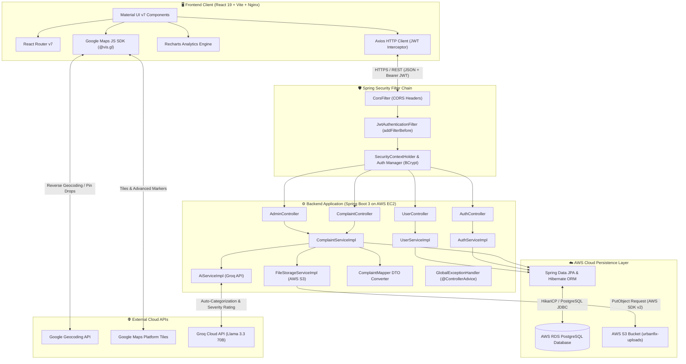
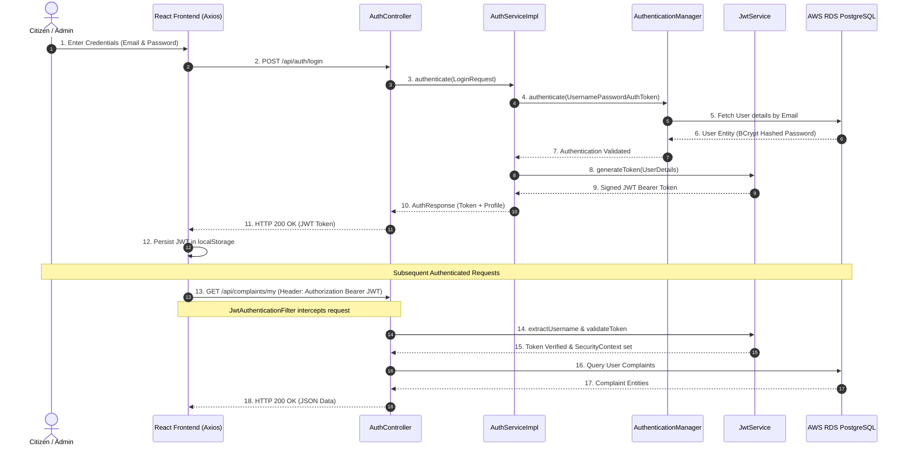
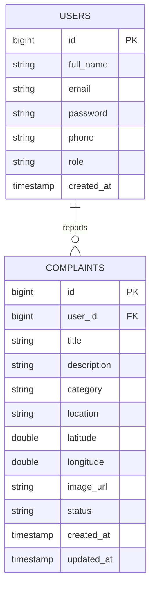
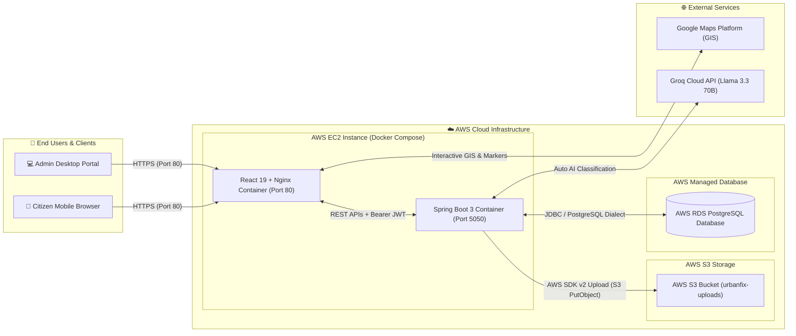

# 🏙️ UrbanFix - Civic Issue Reporting & Management Platform

UrbanFix is a production-grade full-stack civic engagement platform that enables citizens to report public infrastructure issues with GPS coordinates, detailed descriptions, AI-assisted complaint classification, and photo evidence stored on cloud object storage.

---

## ✨ Features Implemented

- **Authentication & Security**: Stateless JWT authentication, Spring Security RBAC (`CITIZEN` / `ADMIN`), BCrypt password hashing.
- **Civic Reporting**: Issue reporting with Google Maps interactive pin-drop, browser geolocation, reverse-geocoding, photo uploads, and real-time status feeds.
- **AI Triage & Classification (Groq)**: Automated complaint categorization & severity scoring via Groq Cloud API (`llama-3.3-70b-versatile`).
- **Cloud Evidence Storage (AWS S3)**: Scalable object storage integration for civic complaint photos and evidence.
- **Admin Dashboard**: Triage lifecycle management (`PENDING` → `IN_PROGRESS` → `RESOLVED` / `REJECTED`) & Recharts interactive telemetry analytics.
- **Containerized Cloud Infrastructure**: Built with Docker multi-stage builds and deployed on **AWS EC2** backed by **AWS RDS PostgreSQL**.

---

## 🏗️ Tech Stack

### Frontend (`frontend/`)
- **Framework**: React 19 + Vite 6
- **UI Library**: Material UI (MUI v7)
- **GIS & Mapping**: `@vis.gl/react-google-maps` (Google Maps JS SDK + Geocoding API)
- **Analytics & HTTP**: Recharts v2, Axios (JWT Bearer interceptors)
- **Web Server / Runtime**: Nginx (Alpine) containerized via multi-stage Docker build

### Backend (`backend/`)
- **Core Framework**: Java 21, Spring Boot 3.4
- **Security**: Spring Security, JWT (JJWT v0.12), BCrypt
- **AI Integration**: Groq Cloud API (`llama-3.3-70b-versatile`) via RestTemplate
- **Cloud Storage**: AWS S3 (AWS SDK v2 `software.amazon.awssdk:s3`) for complaint photo evidence
- **Database & ORM**: AWS RDS PostgreSQL, Spring Data JPA, Hibernate (`PostgreSQLDialect`)
- **API Documentation**: OpenAPI 3.1 / Swagger UI

### Infrastructure & Cloud Deployment (AWS)
- **Hosting / Compute**: AWS EC2 Instance (Linux) running Docker & Docker Compose
- **Database Service**: AWS RDS PostgreSQL (Managed Relational Database)
- **Object Storage**: AWS S3 Bucket (`urbanfix-uploads`)
- **Containerization**: Docker & Docker Compose (`docker-compose.yml`)

---

## 🏛️ System Architecture

UrbanFix follows an enterprise 3-tier web application architecture featuring stateless RESTful communication, declarative security filtering, client-side GIS mapping, AI classification, AWS S3 file persistence, and AWS RDS PostgreSQL relational storage.



---

### 🔄 End-to-End Data & Request Lifecycle

1. **Authentication & Authorization Pipeline**:
   - User submits credentials (`email`, `password`) via React login form.
   - Spring Security authenticates identity using BCrypt password verification.
   - Upon validation, `JwtService` issues a signed JSON Web Token (JWT).
   - React stores the JWT token locally; Axios request interceptors automatically append `Authorization: Bearer <token>` to every subsequent REST request.
   - `JwtAuthenticationFilter` validates token signature on incoming requests and injects `SecurityContextHolder` credentials.

2. **Civic Complaint Reporting & AWS S3 Evidence Storage**:
   - Citizen drops an interactive pin on `LocationPickerMap` or triggers browser GPS positioning.
   - Frontend calls Google Geocoding API to resolve coordinates (`lat`, `lng`) into a street address.
   - Submitting the form sends a `multipart/form-data` payload (`JSON metadata` + `Photo Evidence File`).
   - `FileStorageServiceImpl` delegates file upload to **AWS S3** (`storage.provider=s3`) using AWS SDK v2 (`S3Client`), generating a public HTTPS URL (`https://<bucket>.s3.<region>.amazonaws.com/uploads/<filename>`).
   - `AiServiceImpl` calls **Groq Cloud API (`llama-3.3-70b-versatile`)** to automatically classify issue category, evaluate severity (`HIGH`/`MEDIUM`/`LOW`), and generate a structured description.
   - `ComplaintServiceImpl` transforms the DTO into a `Complaint` JPA entity with initial `PENDING` status and commits to **AWS RDS PostgreSQL** via Hibernate.

3. **Admin Telemetry & Operations Pipeline**:
   - Municipal admins access `/admin/dashboard` protected by `@PreAuthorize("hasRole('ADMIN')")`.
   - Spring Boot executes dynamic JPA `Specification` queries and custom aggregation repository methods on **AWS RDS PostgreSQL** (`COUNT(c.status)`, `GROUP BY category`).
   - Frontend renders citywide geographic complaint pins via `ComplaintOverviewMap` color-coded by status alongside Recharts telemetry graphs.
   - Status transitions (`PENDING` → `IN_PROGRESS` → `RESOLVED` / `REJECTED`) execute optimistic database updates with updated timestamps.

---

### 🔐 Authentication & JWT Request Flow



---

## 📊 Database Architecture

UrbanFix relies on **AWS RDS PostgreSQL** for relational persistence:



---

## ☁️ Production AWS Infrastructure Blueprint

The deployment blueprint below illustrates the containerized AWS cloud architecture hosting UrbanFix:



---

## 📂 Monorepo Directory Architecture

```text
UrbanFix/ (Root)
├── backend/
│   ├── src/                    # Spring Boot Application Source
│   │   └── main/java/com/urbanfix/
│   │       ├── config/         # AwsS3Config & Security Configurations
│   │       ├── controller/     # REST API Controllers
│   │       ├── entity/         # JPA Entities (User, Complaint)
│   │       ├── repository/     # Spring Data JPA Repositories
│   │       └── service/        # FileStorageServiceImpl (AWS S3), AiServiceImpl
│   ├── .mvn/                   # Maven wrapper binaries
│   ├── mvnw                    # Maven wrapper script (Linux/macOS)
│   ├── mvnw.cmd                # Maven wrapper script (Windows)
│   ├── pom.xml                 # Maven POM configuration (Java 21, AWS SDK v2)
│   └── src/main/resources/     # application.properties (PostgreSQL & S3 config)
│
├── frontend/
│   ├── src/                    # React 19 + MUI Application Source
│   ├── public/                 # Static assets & favicon
│   ├── Dockerfile              # Multi-stage Docker build (Node + Nginx)
│   ├── nginx.conf              # Production Nginx reverse proxy configuration
│   ├── package.json            # npm dependencies & scripts
│   └── vite.config.js          # Vite build & proxy configuration
│
├── Dockerfile                  # Backend production Dockerfile (OpenJDK 21 Alpine)
├── docker-compose.yml          # Container orchestration (AWS EC2 ready)
├── .gitignore                  # Root Git ignore rules
├── AGENTS.md                   # AI & developer guidelines
└── README.md                   # Complete platform documentation & setup guide
```

---

## 📌 REST API Endpoint Reference

### Authentication
| Method | Endpoint | Access | Description |
| :--- | :--- | :--- | :--- |
| `POST` | `/api/auth/register` | Public | Register a new citizen account |
| `POST` | `/api/auth/login` | Public | Authenticate user and issue JWT token |

### Complaints (Citizen)
| Method | Endpoint | Access | Description |
| :--- | :--- | :--- | :--- |
| `POST` | `/api/complaints` | Authenticated | Create a new complaint (multipart form data, uploads photo to S3) |
| `GET` | `/api/complaints/my` | Authenticated | Fetch current user's submitted complaints |
| `GET` | `/api/complaints/{id}` | Authenticated | Fetch single complaint details by ID |
| `PUT` | `/api/complaints/{id}` | Owner Only | Update complaint details |
| `DELETE` | `/api/complaints/{id}` | Owner Only | Delete a complaint |

### Admin & Telemetry
| Method | Endpoint | Access | Description |
| :--- | :--- | :--- | :--- |
| `GET` | `/api/admin/complaints` | Admin | Fetch paginated complaint queue with status & category filters |
| `PATCH` | `/api/complaints/{id}/status` | Admin | Update resolution status of a complaint |
| `GET` | `/api/admin/dashboard` | Admin | Fetch citywide complaint volume statistics |
| `GET` | `/api/admin/dashboard/categories` | Admin | Fetch complaint breakdown grouped by category |
| `GET` | `/api/admin/dashboard/monthly` | Admin | Fetch monthly reporting trends |

---

## ⚙️ Environment Configuration & Deployment Setup

### 🔑 Required Environment Variables

Create a `.env` file in the root directory (or pass via AWS EC2 environment):

```env
# AWS RDS PostgreSQL Database Configuration
SPRING_DATASOURCE_URL=jdbc:postgresql://<your-rds-endpoint>.rds.amazonaws.com:5432/urbanfix_db
SPRING_DATASOURCE_USERNAME=postgres
SPRING_DATASOURCE_PASSWORD=your_rds_password

# AWS S3 Storage Credentials
STORAGE_PROVIDER=s3
AWS_S3_BUCKET_NAME=urbanfix-uploads
AWS_REGION=ap-south-1
AWS_ACCESS_KEY_ID=YOUR_AWS_ACCESS_KEY_ID
AWS_SECRET_ACCESS_KEY=YOUR_AWS_SECRET_ACCESS_KEY

# External APIs
GROQ_API_KEY=gsk_your_groq_api_key
VITE_GOOGLE_MAPS_API_KEY=AIzaSyYourGoogleMapsApiKey
```

---

### ☁️ AWS EC2 Docker Deployment

1. **SSH into your AWS EC2 Instance**:
   ```bash
   ssh -i your-key.pem ubuntu@your-ec2-public-ip
   ```

2. **Clone the repository & navigate to project root**:
   ```bash
   git clone https://github.com/SHIBAM-GHOSH/UrbanFix.git
   cd UrbanFix
   ```

3. **Configure Environment Variables**:
   Create `.env` file with your AWS RDS, AWS S3, Groq, and Google Maps keys:
   ```bash
   nano .env
   ```

4. **Launch Application using Docker Compose**:
   ```bash
   docker-compose up -d --build
   ```

5. **Verify Running Containers**:
   ```bash
   docker ps
   ```
   - **Frontend (Nginx SPA)**: `http://<ec2-public-ip>:80`
   - **Backend (Spring Boot REST API)**: `http://<ec2-public-ip>:5050`
   - **Swagger Documentation**: `http://<ec2-public-ip>:5050/swagger-ui.html`

---

### 💻 Local Development Setup

#### 1. Backend Setup
In the `backend/` directory, set environment variables or edit `application-local.properties` (ignored by Git):
```bash
cd backend
./mvnw spring-boot:run
```
- Backend REST APIs run on `http://localhost:5050`

#### 2. Frontend Setup
In the `frontend/` directory:
```bash
cd frontend
npm install
npm run dev
```
- Frontend application runs on `http://localhost:5173`

---

## 👨‍💻 Author

**Shibam Ghosh**
- GitHub: [SHIBAM-GHOSH](https://github.com/SHIBAM-GHOSH)
