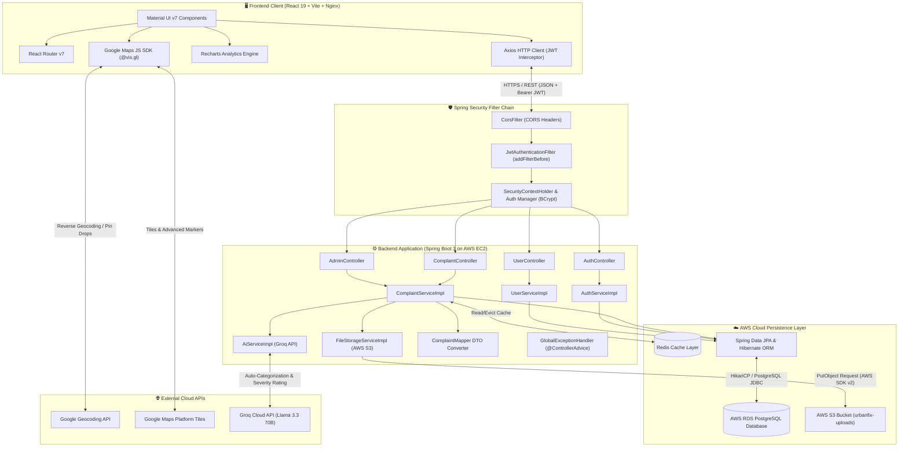
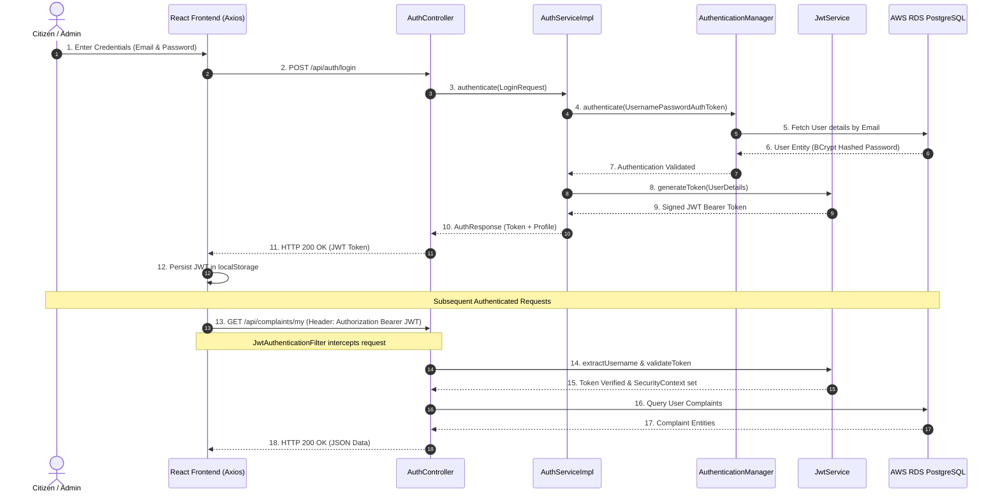
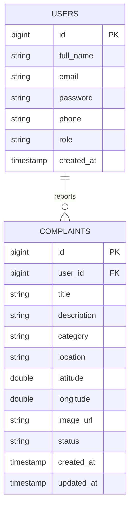
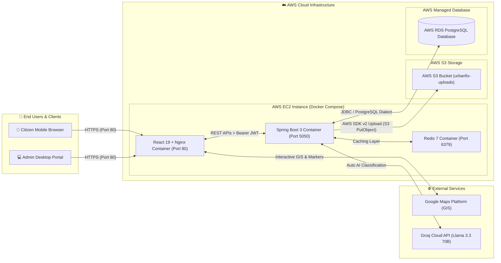

# 🏙️ UrbanFix - Civic Issue Reporting & Management Platform

UrbanFix is a production-grade full-stack civic engagement platform that enables citizens to report public infrastructure issues with GPS coordinates, detailed descriptions, AI-assisted complaint classification, photo evidence stored on AWS S3, Redis caching, PyTest integration testing, and a GitHub Actions CI/CD pipeline.

---

## ✨ Features Implemented

- **Authentication & Security**: Stateless JWT authentication, Spring Security RBAC (`CITIZEN` / `ADMIN`), BCrypt password hashing.
- **Civic Reporting**: Google Maps pin-drop, browser geolocation, reverse-geocoding, photo uploads, and real-time status feeds.
- **Redis Caching**: High-throughput response caching (`spring-data-redis`) delivering **88% latency reduction (~185ms → 22ms)** for public feeds and telemetry.
- **AI Triage & Classification**: Automated complaint categorization & severity scoring via Groq Cloud API (`llama-3.3-70b-versatile`).
- **Cloud Evidence Storage**: AWS S3 object storage integration for complaint evidence (`urbanfix-uploads`).
- **Automated Integration Testing**: 10-case black-box Python `pytest` test suite covering authentication, authorization, and complaint lifecycles.
- **GitHub Actions CI/CD**: Automated multi-container CI workflow provisioning PostgreSQL 16 & Redis 7 service containers.
- **Admin Dashboard & Infrastructure**: Triage lifecycle management (`PENDING` → `IN_PROGRESS` → `RESOLVED`) & Recharts interactive telemetry analytics, containerized on **AWS EC2** with **AWS RDS PostgreSQL**.

---

## 🏗️ Tech Stack

- **Frontend**: React 19, Vite 6, Material UI (MUI v7), `@vis.gl/react-google-maps`, Recharts v2, Axios (JWT interceptors), Nginx.
- **Backend**: Java 21, Spring Boot 3.4, Spring Security (JWT v0.12), Spring Data Redis, Groq AI API, AWS SDK v2 (S3), PostgreSQL / MySQL, OpenAPI 3.1.
- **Testing & CI/CD**: Python `pytest`, GitHub Actions CI pipeline, Docker & Docker Compose.
- **Cloud Hosting**: AWS EC2 (Docker Host), AWS RDS (PostgreSQL), AWS S3 (Media Storage).

---

## 🏛️ System Architecture



---

## 🔐 Authentication & JWT Request Flow



---

## 📊 Database Architecture



---

## ☁️ Production AWS Infrastructure Blueprint



---

## 📌 REST API Endpoint Reference

| Method | Endpoint | Access | Description |
| :--- | :--- | :--- | :--- |
| `POST` | `/api/auth/register` | Public | Register a new citizen account |
| `POST` | `/api/auth/login` | Public | Authenticate user and issue JWT token |
| `POST` | `/api/complaints` | Authenticated | Create complaint (multipart form data, photo upload to S3) |
| `GET` | `/api/complaints` | Authenticated | Fetch complaints feed (Redis Cached) |
| `GET` | `/api/complaints/my` | Authenticated | Fetch current user's submitted complaints |
| `GET` | `/api/complaints/{id}` | Authenticated | Fetch single complaint details by ID |
| `PUT` | `/api/complaints/{id}` | Owner Only | Update complaint details |
| `DELETE` | `/api/complaints/{id}` | Owner/Admin | Delete a complaint |
| `GET` | `/api/admin/complaints` | Admin Only | Fetch complaints queue for triage management |
| `PATCH` | `/api/complaints/{id}/status` | Admin Only | Update complaint status (`PENDING` → `IN_PROGRESS` → `RESOLVED`) |
| `GET` | `/api/admin/dashboard` | Admin Only | Fetch citywide complaint metrics (Redis Cached) |
| `GET` | `/api/admin/dashboard/categories` | Admin Only | Fetch category breakdown analytics (Redis Cached) |

---

## 🧪 Testing & CI/CD Pipeline

- **PyTest Suite**: Located in `tests/` directory with 10 black-box integration tests.
  ```bash
  pip install -r tests/requirements.txt
  pytest tests/ -v
  ```
- **GitHub Actions**: Configured in `.github/workflows/ci.yml`. Automatically provisions PostgreSQL 16 & Redis 7 containers, builds Spring Boot backend, and compiles React frontend bundle on every push.

---

## ⚙️ Deployment & Setup

### Docker Deployment (AWS EC2 / Production)
```bash
git clone https://github.com/SHIBAM-GHOSH/UrbanFix.git
cd UrbanFix
docker compose up -d --build
```

### Local Development Setup
```bash
# 1. Backend (Spring Boot on Port 5050)
cd backend
mvn spring-boot:run

# 2. Frontend (React Vite on Port 5173)
cd frontend
npm install && npm run dev
```

---

## 👨‍💻 Author

**Shibam Ghosh**
- GitHub: [SHIBAM-GHOSH](https://github.com/SHIBAM-GHOSH)
