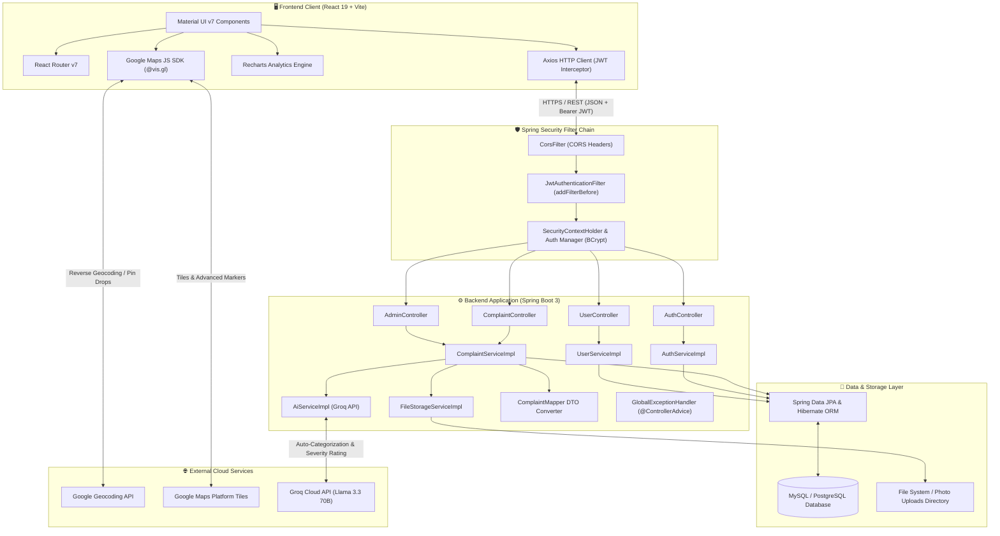
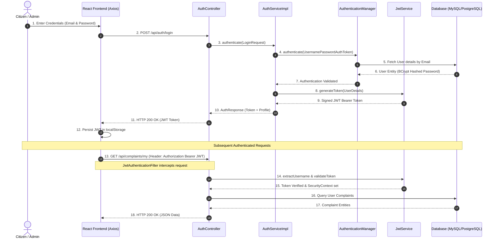
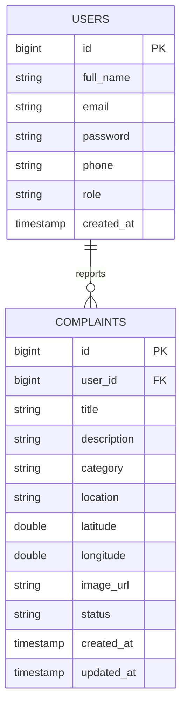
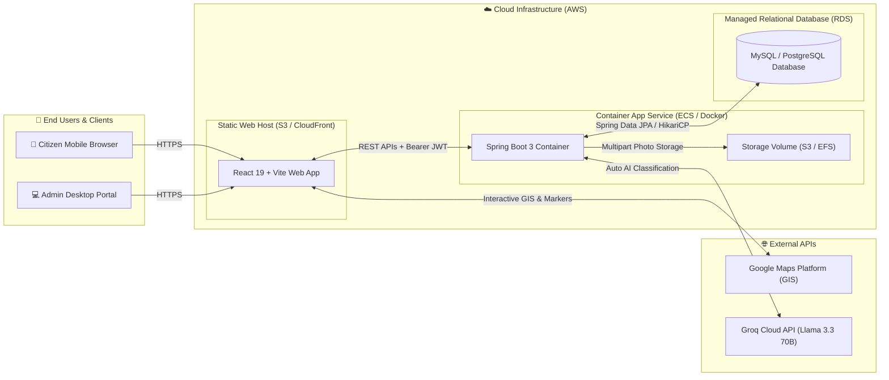

# 🏙️ UrbanFix - Civic Issue Reporting & Management Platform

UrbanFix is a production-grade full-stack civic engagement platform that enables citizens to report public infrastructure issues with GPS coordinates, descriptions, and photo evidence.

---

## ✨ Features Implemented

- **Authentication & Security**: Stateless JWT auth, Spring Security RBAC (`CITIZEN` / `ADMIN`), BCrypt password hashing.
- **Civic Reporting**: Issue reporting with Google Maps GPS pin-drop, reverse-geocoding, photo uploads, and status feeds.
- **AI Classification (Groq)**: Automated complaint categorization & severity scoring via Groq API (`llama-3.3-70b-versatile`).
- **Admin Dashboard**: Triage management (`PENDING` → `IN_PROGRESS` → `RESOLVED` / `REJECTED`) & Recharts analytics.

---

## 🏗️ Tech Stack

### Frontend (`frontend/`)
- **Framework**: React 19 + Vite 6
- **UI Library**: Material UI (MUI v7)
- **GIS & Mapping**: `@vis.gl/react-google-maps` (Google Maps JS SDK + Geocoding API)
- **Analytics & HTTP**: Recharts v2, Axios (JWT interceptors)

### Backend (`backend/`)
- **Core Framework**: Java 21, Spring Boot 3.4
- **Security**: Spring Security, JWT (JJWT v0.12), BCrypt
- **AI Service**: Groq Cloud API (`llama-3.3-70b-versatile`) via RestTemplate
- **Database & ORM**: MySQL 8 / PostgreSQL, Spring Data JPA, Hibernate
- **API Documentation**: OpenAPI 3.1 / Swagger UI

---


## 🏛️ System Architecture

UrbanFix follows an enterprise 3-tier web application architecture featuring stateless RESTful communication, declarative security filtering, client-side GIS mapping, and dynamic database querying.



### 🔄 End-to-End Data & Request Lifecycle

1. **Authentication & Authorization Pipeline**:
   - User submits credentials (`email`, `password`) via React login form.
   - Spring Security authenticates identity using BCrypt password verification.
   - Upon validation, `JwtService` issues a signed JSON Web Token (JWT) with an expiration claim.
   - React stores the JWT token locally; Axios request interceptors automatically append `Authorization: Bearer <token>` to every subsequent REST request.
   - `JwtAuthenticationFilter` validates token signature on incoming requests and injects `SecurityContextHolder` credentials.

2. **Civic Complaint Reporting & AI Triage Pipeline**:
   - Citizen drops an interactive pin on `LocationPickerMap` or triggers browser GPS positioning.
   - Frontend calls Google Geocoding API to resolve coordinates (`lat`, `lng`) into a street address.
   - Submitting the form sends a `multipart/form-data` payload (`JSON metadata` + `Photo Evidence File`).
   - `FileStorageServiceImpl` validates and persists the image evidence file to storage.
   - `AiServiceImpl` calls **Groq Cloud API (`llama-3.3-70b-versatile`)** to automatically classify issue category, evaluate severity (`HIGH`/`MEDIUM`/`LOW`), and generate a structured description.
   - `ComplaintServiceImpl` transforms the DTO into a `Complaint` JPA entity with initial `PENDING` status and commits to database via Hibernate.

3. **Admin Telemetry & Operations Pipeline**:
   - Municipal admins access `/admin/dashboard` protected by `@PreAuthorize("hasRole('ADMIN')")`.
   - Spring Boot executes dynamic JPA `Specification` queries and custom aggregation repository methods (`COUNT(c.status)`, `GROUP BY category`).
   - Frontend renders citywide geographic complaint pins via `ComplaintOverviewMap` color-coded by status alongside Recharts telemetry graphs.
   - Status transitions (`PENDING` → `IN_PROGRESS` → `RESOLVED` / `REJECTED`) execute optimistic database updates with updated timestamps.

---

### 🔐 Authentication & JWT Request Flow



---


## 📊 Database Architecture



---

## ☁️ Production Deployment Infrastructure Blueprint

The deployment blueprint below illustrates the containerized cloud architecture (e.g., AWS ECS, S3/CloudFront, RDS) hosting UrbanFix:




---

## 📂 Monorepo Directory Architecture

```text
UrbanFix/ (Root)
├── backend/
│   ├── src/                    # Spring Boot Application Source
│   ├── .mvn/                   # Maven wrapper binaries
│   ├── mvnw                    # Maven wrapper script (Linux/macOS)
│   ├── mvnw.cmd                # Maven wrapper script (Windows)
│   ├── pom.xml                 # Maven POM configuration
│   ├── HELP.md                 # Spring Boot help guide
│   └── uploads/                # Uploaded civic issue photos storage
│
├── frontend/
│   ├── src/                    # React 19 + MUI Application Source
│   ├── public/                 # Static assets & favicon
│   ├── package.json            # npm dependencies & scripts
│   ├── vite.config.js          # Vite build & proxy configuration
│   └── openapi.json            # OpenAPI 3.1 specification reference
│
├── .gitignore                  # Root Git ignore rules (build artifacts, node_modules)
├── AGENTS.md                   # AI & developer guidelines
└── README.md                   # Complete platform documentation & setup guide
```

---

## 📌 REST API Endpoint Reference

### Authentication
| Method | Endpoint | Access | Description |
| :--- | :--- | :--- | :--- |
| `POST` | `/api/auth/register` | Public | Register a new citizen account |
| `POST` | `/api/auth/login` | Public | Authenticate user and issue JWT token |

### Complaints (Citizen)
| Method | Endpoint | Access | Description |
| :--- | :--- | :--- | :--- |
| `POST` | `/api/complaints` | Authenticated | Create a new complaint (multipart form data) |
| `GET` | `/api/complaints/my` | Authenticated | Fetch current user's submitted complaints |
| `GET` | `/api/complaints/{id}` | Authenticated | Fetch single complaint details by ID |
| `PUT` | `/api/complaints/{id}` | Owner Only | Update complaint details |
| `DELETE` | `/api/complaints/{id}` | Owner Only | Delete a complaint |

### Admin & Telemetry
| Method | Endpoint | Access | Description |
| :--- | :--- | :--- | :--- |
| `GET` | `/api/admin/complaints` | Admin | Fetch paginated complaint queue with status & category filters |
| `PATCH` | `/api/complaints/{id}/status` | Admin | Update resolution status of a complaint |
| `GET` | `/api/admin/dashboard` | Admin | Fetch citywide complaint volume statistics |
| `GET` | `/api/admin/dashboard/categories` | Admin | Fetch complaint breakdown grouped by category |
| `GET` | `/api/admin/dashboard/monthly` | Admin | Fetch monthly reporting trends |

---

## ⚙️ Local Setup & Running Instructions

### 1. Database Configuration (MySQL)
Create a MySQL database named `urbanfix_db`:
```sql
CREATE DATABASE urbanfix_db;
```

Update `backend/src/main/resources/application.properties` with your database credentials:
```properties
spring.datasource.url=jdbc:mysql://localhost:3306/urbanfix_db?useSSL=false&serverTimezone=UTC
spring.datasource.username=YOUR_MYSQL_USERNAME
spring.datasource.password=YOUR_MYSQL_PASSWORD

jwt.secret=YOUR_64_CHARACTER_BASE64_SECRET_KEY
jwt.expiration=86400000
```

### 2. Start Backend Server (Spring Boot)
In the `backend/` directory:
```bash
cd backend
./mvnw spring-boot:run
```
- Backend REST APIs run on: `http://localhost:5050`
- Swagger API Documentation: `http://localhost:5050/swagger-ui.html`

### 3. Start Frontend Development Server (React + Vite)
In the `frontend/` directory:
```bash
cd frontend
npm install
npm run dev
```
- Frontend application runs on: `http://localhost:5173`
- Vite automatically proxies `/api/*` and `/uploads/*` requests to `http://localhost:5050`.

---

## 👨‍💻 Author

**Shibam Ghosh**
- GitHub: [SHIBAM-GHOSH](https://github.com/SHIBAM-GHOSH)
